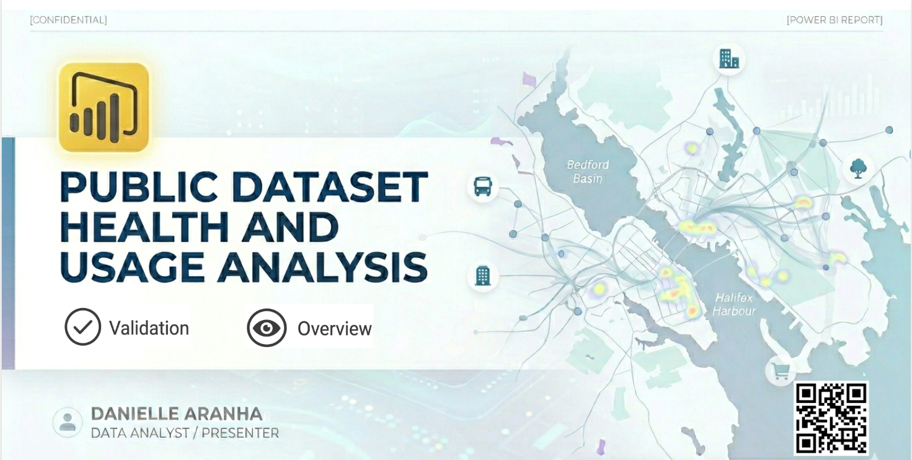
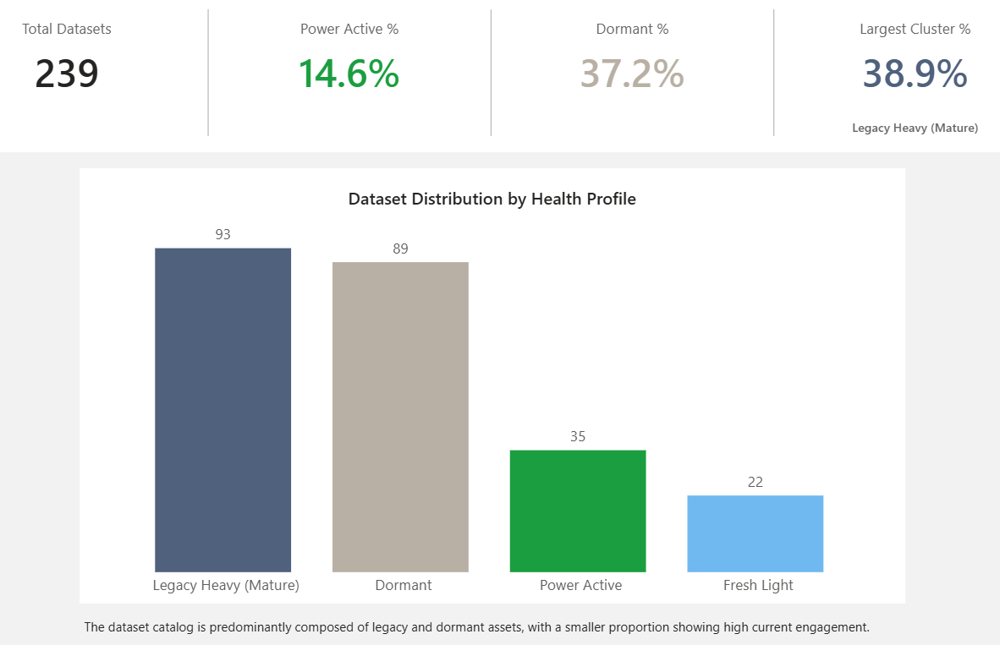
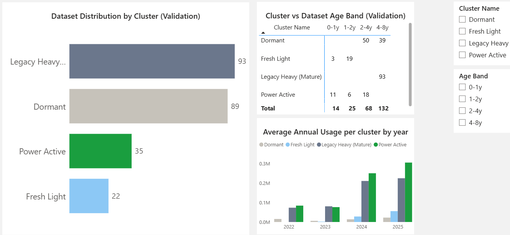
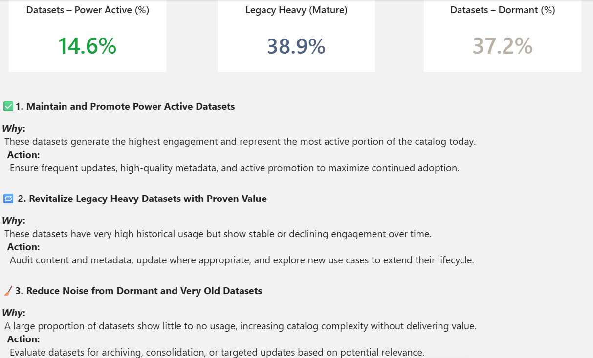

# HRM Open Data Analytics



## Business Intelligence & Data Analytics Case Study

### K-Means Clustering & Data Governance Analysis

An end-to-end Business Intelligence and Data Analytics project using publicly available open data from the Halifax Regional Municipality (HRM) Open Data Portal.

The project analyzes historical dataset usage and metadata to identify patterns in dataset activity, accessibility, and lifecycle status. SQL, Python, K-Means clustering, data modeling, DAX, and Power BI were used to transform raw open-data information into analytical profiles and governance-oriented insights.

> **Author:** Danielle Aranha
> **Project Type:** Academic Business Intelligence & Analytics Project
> **Data Source:** Halifax Regional Municipality Open Data Portal
> **Tools:** SQL Server, Python, pandas, scikit-learn, Power BI, DAX, Excel

---

## Project Overview

Open-data portals contain large collections of datasets that vary considerably in age, usage, update frequency, and public engagement.

This project explores whether historical usage and metadata indicators can be used to identify meaningful dataset profiles and support data governance considerations.

The analysis focuses on questions such as:

* Which datasets show higher levels of public activity?
* Which datasets have remained largely inactive?
* Are there identifiable patterns in dataset usage?
* Can datasets be grouped into meaningful usage profiles?
* How can these profiles support data lifecycle and governance discussions?

The project combines analytical and Business Intelligence techniques to move from raw metadata and usage records to interpretable insights.

---

## Dataset & Data Context

The analysis uses publicly available HRM Open Data Portal information, including dataset metadata and historical usage-related observations.

The source contains approximately **639,000 records across 239 datasets**.

The 639,000 records represent repeated historical observations rather than 639,000 unique datasets. This distinction is important because the data captures dataset activity over time and therefore supports longitudinal analysis.

The analysis incorporates variables related to:

* Dataset identity
* Dataset age
* Publication and update information
* Usage and activity indicators
* Historical observations
* Dataset categorization
* Temporal characteristics

Because the project uses historical open-data information, the results represent the available data period and should not be interpreted as a real-time assessment of current HRM datasets.

---

# Project Workflow

The project follows an end-to-end analytical workflow:

**Raw Open Data → Data Preparation → SQL Analysis → Feature Engineering → K-Means Clustering → Data Modeling → Power BI → Governance Insights**

---

## 01 — Data Preparation & SQL Analysis

The first stage focused on understanding, cleaning, and structuring the source data.

SQL Server was used to:

* Inspect the raw datasets
* Validate data types and structures
* Identify missing and inconsistent values
* Transform and aggregate historical observations
* Create analytical datasets
* Calculate usage-related metrics
* Prepare data for clustering and visualization

The SQL analysis provided the foundation for the subsequent Python and Power BI stages.

Key analytical considerations included:

* Dataset age
* Activity levels
* Historical usage
* Recency
* Frequency of observations
* Relationships between dataset characteristics and usage patterns

---

## 02 — Feature Engineering & K-Means Clustering

Python was used to prepare the analytical features and perform unsupervised machine learning using **K-Means clustering**.

The clustering process was designed to identify groups of datasets with similar characteristics based on selected usage and metadata indicators.

### Analytical Process

1. Select relevant analytical variables
2. Prepare and transform features
3. Evaluate the data for clustering
4. Apply K-Means clustering using scikit-learn
5. Examine cluster characteristics
6. Interpret the resulting dataset profiles

The objective was not to predict future dataset usage, but to identify **descriptive patterns** within the historical data.

### Dataset Profiles

The resulting clusters were interpreted according to their observed characteristics rather than treated as definitive business classifications.

The analysis identified profiles associated with differences in:

* Activity level
* Historical engagement
* Dataset age
* Recency
* Usage patterns

These profiles were subsequently incorporated into the Power BI analysis.

---

## Cluster Evaluation

The clustering analysis included supporting evaluation steps to assess the selected number of clusters and the resulting dataset profiles.

The repository includes:

* **K selection metrics** — supporting metrics used to compare different cluster configurations
* **Silhouette analysis** — used to assess the separation and cohesion of the resulting clusters
* **Cluster profiles** — summarized characteristics of each identified cluster
* **Cluster visualization** — visual representation of the resulting dataset groups

These outputs support the interpretation of the K-Means results and provide transparency into the analytical process.

Supporting files are available in the `Python` folder.

---

## 03 — Power BI Solution

The Power BI report integrates the analytical results into an interactive Business Intelligence environment.

The solution combines dataset usage metrics, clustering results, validation indicators, and governance-oriented analysis into a single reporting experience.

### Dashboard Pages

#### Overview

Provides a high-level view of dataset activity, usage patterns, and the resulting analytical profiles.



#### Validation

Provides supporting metrics and visual analysis used to validate and interpret the analytical results.



#### Governance Considerations

Uses the analytical findings to highlight dataset profiles and areas that may warrant further review from a data governance perspective.



### Report Features

The Power BI solution includes:

* Data modeling
* DAX measures
* KPI-style indicators
* Interactive filtering
* Drill-down analysis
* Tooltips
* Time-based analysis
* Cluster-based dataset profiling
* Governance-oriented reporting

> **Note:** The Power BI report (`OpenDataMetrics.pbix`) is included in the `PowerBI` folder.

---

## 04 — Governance Considerations

The analytical profiles can provide a starting point for discussions around dataset lifecycle, maintenance, discoverability, and public engagement.

The analysis suggests several areas that could warrant further consideration:

### Maintain & Promote

Highly active datasets may warrant continued attention and promotion due to their observed levels of public engagement.

### Review & Revitalize

Historically valuable datasets with lower recent activity may benefit from modernization, improved discoverability, updated documentation, or renewed promotion.

### Investigate Low Activity

Dormant or very old datasets with limited observed activity may warrant additional review before potential lifecycle decisions are considered.

These are **analytical considerations rather than official recommendations to HRM**. Actual governance or lifecycle decisions would require additional information, including business relevance, data quality, operational requirements, stakeholder needs, legal considerations, and current usage information.

---

# Data Model

The project uses a structured analytical data model to support consistent reporting and time-based analysis.

The model separates relevant descriptive attributes from historical usage observations, enabling analysis across:

* Dataset
* Time
* Usage and activity
* Dataset profile
* Lifecycle indicators

This structure supports Power BI reporting while reducing unnecessary duplication and improving analytical consistency.

---

# Key Insights

The analysis demonstrated that historical open-data usage is not uniform across datasets.

Several distinct patterns emerged from the clustering analysis, highlighting differences in:

* Dataset activity
* Historical engagement
* Age and recency
* Usage intensity
* Dataset lifecycle characteristics

The results demonstrate how clustering can be used as an exploratory analytical technique to segment datasets into interpretable profiles.

The Power BI layer then connects these analytical profiles with descriptive and temporal information, allowing users to explore the characteristics behind each group.

---

# Technical Skills Demonstrated

### SQL

* SQL Server
* Data extraction and transformation
* Aggregation
* Data validation
* Analytical queries
* Feature preparation

### Python

* pandas
* Data preparation
* Exploratory analysis
* Feature engineering
* scikit-learn
* K-Means clustering

### Power BI

* Data modeling
* DAX
* KPI development
* Interactive dashboards
* Drill-down analysis
* Data visualization

### Data & Governance

* Data quality considerations
* Dataset lifecycle analysis
* Usage analysis
* Data profiling
* Analytical interpretation
* Governance-oriented insights

---

# Project Structure

```text
HRM-Open-Data-Analytics/
│
├── Data/
│
├── Documentation/
│   └── PROJECT_DOCUMENTATION.md
│
├── PowerBI/
│   ├── Screenshots/
│   │   ├── Cover.png
│   │   ├── Overview.png
│   │   ├── Recommendation.png
│   │   └── Validation.png
│   │
│   └── OpenDataMetrics.pbix
│
├── Python/
│   ├── HRM_Dataset_Clustering.ipynb
│   ├── cluster_profiles.csv
│   ├── cluster_visualization.png
│   ├── k_selection.png
│   ├── k_selection_metrics.csv
│   └── silhouette_analysis.png
│
├── SQL/
│   └── Query_Report_BI_Project.sql
│
└── README.md
```

### Folder Overview

* **Data** — Source and prepared data used throughout the project
* **Documentation** — Detailed project documentation and methodology
* **PowerBI** — Power BI report and dashboard screenshots
* **Python** — Data preparation, clustering analysis, model evaluation, and supporting outputs
* **SQL** — SQL Server queries and analytical transformations

---

# Limitations

Several limitations should be considered when interpreting the results.

### Historical Data

The analysis is based on historical observations and does not necessarily represent the current state of the HRM Open Data Portal.

### Usage Metrics

Usage indicators provide signals of activity but should not be interpreted as direct measures of dataset value or importance.

### Clustering

K-Means identifies statistical similarities within the selected variables. Cluster membership does not represent an official HRM classification.

### Governance Decisions

The analysis alone is not sufficient to determine whether a dataset should be maintained, updated, promoted, archived, or removed.

Additional factors such as business value, data quality, legal requirements, stakeholder needs, and operational dependencies would need to be considered.

---

# Project Outcome

This project demonstrates how historical open-data usage can be transformed into actionable analytical profiles using **SQL, Python, K-Means clustering, and Power BI**.

The resulting framework connects technical data analysis with practical data governance considerations while recognizing that usage metrics should be evaluated alongside business relevance, data quality, and stakeholder needs.

The project highlights an end-to-end approach to Business Intelligence: from raw public data and structured analysis to machine learning, visualization, and decision-support insights.

---

# Repository Contents

* **Data** — Source and prepared datasets
* **Documentation** — Project documentation and supporting materials
* **PowerBI** — Power BI report and dashboard screenshots
* **Python** — Data preparation, analysis, clustering, and supporting outputs
* **SQL** — SQL Server queries and analytical transformations

---

# Disclaimer

This is an academic portfolio project developed using publicly available HRM Open Data.

The analysis and governance considerations presented in this repository are the author's own analytical work and do not represent official recommendations, policies, or decisions by the Halifax Regional Municipality.
